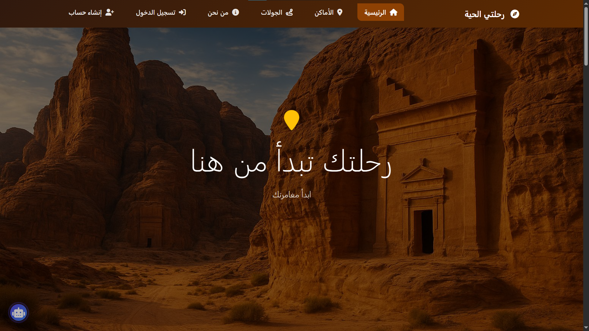
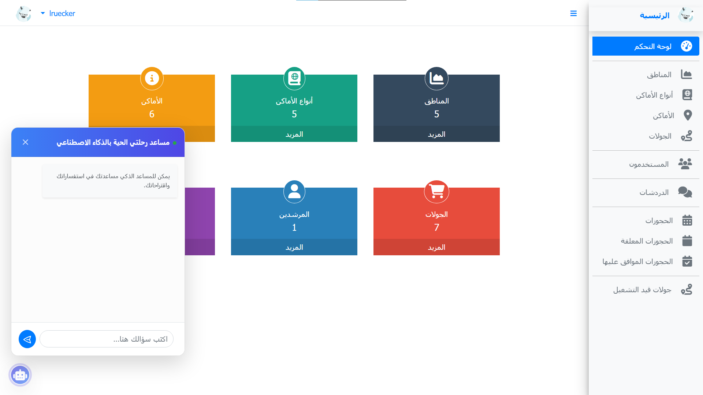
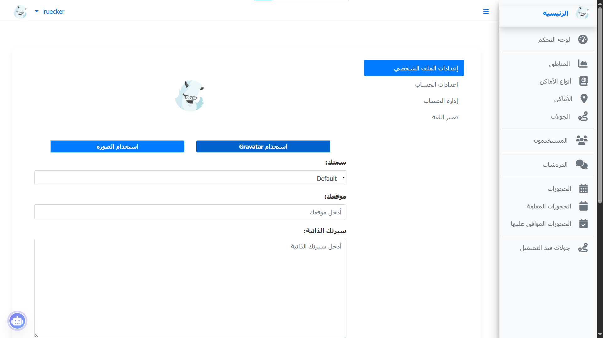

# رحلتي الحية - MyLiveJourney

[](https://opensource.org/licenses/MIT)
[](https://laravel.com)

**MyLiveJourney** هو نظام متكامل لإدارة الرحلات السياحية مبني باستخدام إطار العمل **Laravel 10**. يوفر النظام منصة تربط السياح بالمرشدين السياحيين، مع دمج تقنيات الذكاء الاصطناعي لتسهيل تجربة المستخدم.





---

## 🚀 المميزات الرئيسية

### 🌍 نظام إدارة السياحةee
- **استكشاف الوجهات:** تصفح الأماكن السياحية وتصنيفها حسب المناطق والأنواع.
- **جولات سياحية:** عرض تفاصيل الرحلات، الأسعار، والمواعيد.
- **إدارة الحجوزات:** نظام متكامل لطلب وحجز الرحلات مع تتبع حالة الحجز (قيد الانتظار، مقبول، مرفوض).

### 🤖 المساعد الذكي (AI Assistant)
- دمج تقنية **Google Gemini AI** لتقديم إجابات ذكية وتوصيات سياحية مخصصة للمستخدمين.

### 💬 نظام المحادثة الفورية
- غرف دردشة مباشرة بين المرشدين والسياح باستخدام **Pusher**.
- إشعارات فورية وتحديثات حالة الرحلات.

### 🔐 الأمان وإدارة المستخدمين
- **تعدد الأدوار (ACL):** نظام متقدم للأدوار (مسؤول، مرشد، مستخدم).
- **التحقق بخطوتين (2FA):** دعم التحقق بخطوتين لزيادة أمان الحسابات.
- **سجلات النشاط:** مراقبة كافة التحركات والعمليات داخل النظام.
- **التسجيل الاجتماعي:** دعم الدخول عبر Google, Facebook, Twitter وغيرها.

### 🎨 واجهة المستخدم
- تصميم عصري يجمع بين **Bootstrap** و **Tailwind CSS**.
- دعم تعدد اللغات (العربية، الإنجليزية، إلخ).
- نظام إدارة القوالب (Themes) لتغيير مظهر المنصة.


## 🛠 التقنيات المستخدمة

- **Backend:** Laravel 10.x, PHP 8.1+
- **Frontend:** Blade, Vite, Tailwind CSS, Bootstrap 4
- **Database:** MySQL
- **Real-time:** Pusher
- **AI:** Google Gemini PHP Client
- **Localization:** Mcamara Laravel Localization

---

## ⚙️ تعليمات التثبيت

1. قم بتحميل المشروع:
   ```bash
   git clone https://github.com/your-repo/MyLiveJourney.git
   ```

2. قم بتثبيت التبعات (Dependencies):
   ```bash
   composer install
   npm install
   ```

3. قم بإنشاء ملف الإعدادات:
   ```bash
   cp .env.example .env
   ```

4. قم بتوليد مفتاح التطبيق:
   ```bash
   php artisan key:generate
   ```

5. قم بإعداد قاعدة البيانات في ملف `.env` ثم قم بتهجير الجداول وبذر البيانات:
   ```bash
   php artisan migrate --seed
   ```

6. قم ببناء الأصول (Assets):
   ```bash
   npm run dev
   ```

---

## 👥 بيانات التجربة (Seeded Users)

| البريد الإلكتروني | كلمة المرور | الصلاحية |
| :--- | :--- | :--- |
| `admin@admin.com` | `password` | مسؤول (Admin) |
| `user@user.com` | `password` | مستخدم (User) |

---

## 📜 الترخيص
المشروع مرخص بموجب رخصة [MIT](LICENSE).
