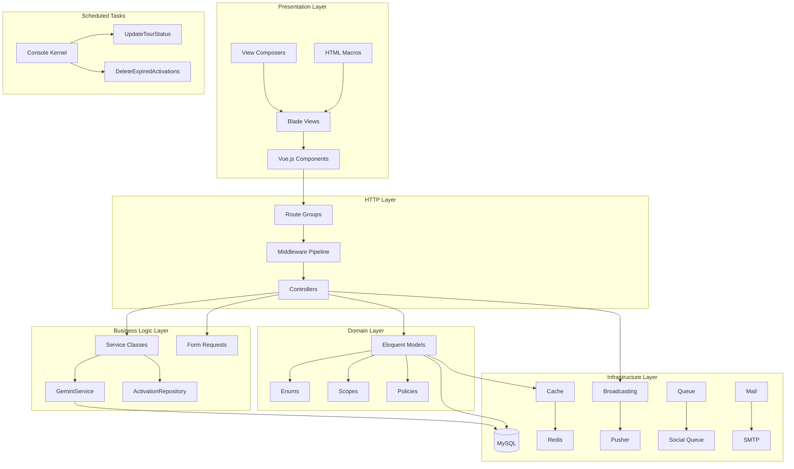
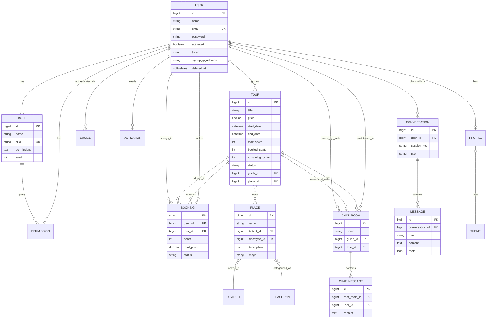
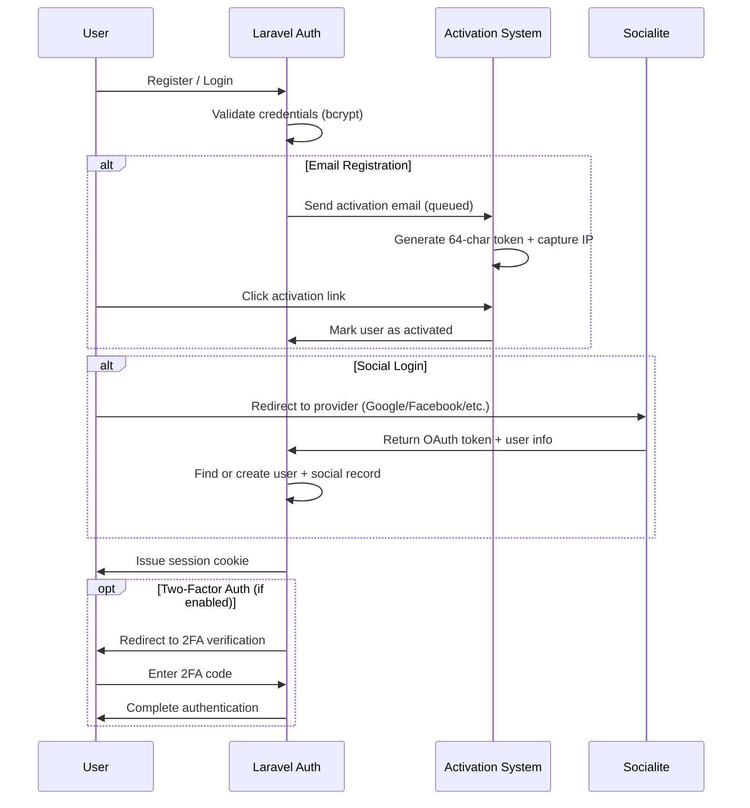
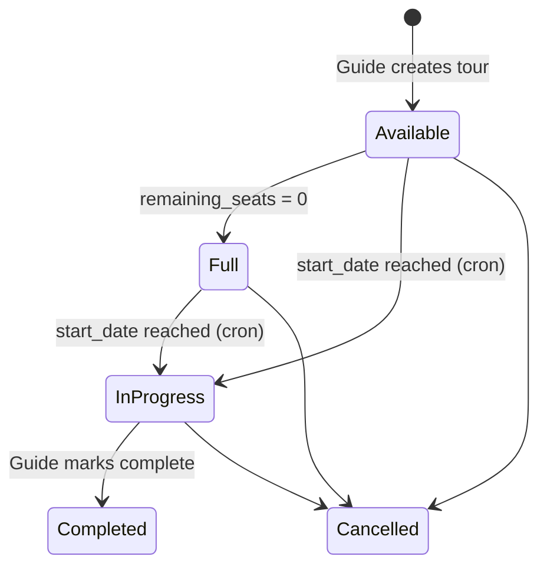

# MyLiveJourney

[](https://opensource.org/licenses/MIT)
[](https://laravel.com)
[](https://php.net)
[](https://vuejs.org)

## Overview

MyLiveJourney (Arabic: \u0631\u062d\u0644\u062a\u064a \u0627\u0644\u062d\u064a\u0629) is a full-featured tourism management platform that connects tourists with licensed tour guides across Saudi Arabia. The system solves the real-world coordination problem between travelers seeking authentic experiences and guides offering curated tours of historical, natural, cultural, entertainment, and religious destinations.

The platform manages the entire tourism lifecycle: destination discovery, tour creation and scheduling, a multi-state booking workflow, real-time guide-tourist communication, and an AI-powered concierge that answers tourist questions using contextual data from the database.

Built as a modular monolith on Laravel 10 with a MySQL backend, the application implements role-based access control across three distinct personas (Admin, Guide, Tourist), email activation workflows, optional two-factor authentication, social OAuth login via nine providers, and bilingual localization with Arabic as the default locale.

---

## Key Features

- **Destination Explorer** -- Browse places filtered by district (Riyadh, Jeddah, AlUla, Abha, Al Khobar) and type (Historical, Natural, Cultural, Entertainment, Religious)
- **Tour Management** -- Guides create tours with pricing, seat capacity, date ranges, and multi-place associations; automatic status transitions via scheduled commands
- **Booking Lifecycle** -- Complete request-approve-reject-cancel workflow with seat decrement, notification emails, and chat room auto-provisioning
- **AI Tourist Assistant** -- Google Gemini-powered chatbot with RAG-like context injection from the tourism database, multi-turn conversation history, and persistent sessions
- **Real-Time Chat** -- Pusher-powered WebSocket chat rooms scoped to tours, with unread message counts, read receipts via broadcast events, and message history
- **Role-Based Access Control** -- Three-tier RBAC (Admin level 5, Guide level 3, User level 0) with 20 granular CRUD permissions across five resource types
- **Email Activation** -- Token-based account verification with configurable max attempts, IP capture, and 72-hour expiry cleanup via scheduled Artisan command
- **Two-Factor Authentication** -- Optional 2FA with configurable grace period and cookie-based bypass
- **Social Authentication** -- OAuth login via Google, Facebook, Twitter, GitHub, YouTube, Twitch, Instagram, LinkedIn, and 37signals
- **User Blocking** -- IP, email, domain, and user-level blocking with configurable blocked types
- **Activity Logging** -- Database-backed audit trail for all user actions
- **Theme System** -- 27+ Bootstrap/Bootswatch themes with per-user profile assignment and polymorphic tagging
- **Bilingual Localization** -- Full Arabic (RTL) and English (LTR) support with 40+ translation files covering every UI element
- **Image Processing** -- Server-side image resizing via Intervention Image for place and profile uploads
- **Dashboard Analytics** -- Aggregate counts for districts, places, tours, users, and guides

---

## Architecture

The application follows the **MVC (Model-View-Controller)** architectural pattern with a **Service Layer** extension for complex business logic. The codebase is organized as a **modular monolith** where domain concerns are separated into distinct directories under the `app/` namespace.

### Architectural Layers

| Layer | Responsibility | Components |
|-------|---------------|------------|
| **Presentation** | HTTP rendering and user interaction | Blade views, Vue.js components, View Composers |
| **Routing & Middleware** | Request filtering, authentication, authorization, localization | 18 middleware, route groups with nested middleware stacks |
| **Controller** | Request handling, input validation, response formatting | 22 controllers organized by domain |
| **Service** | Complex business logic, third-party integrations | `GeminiService`, `ActivationRepository` |
| **Domain (Model)** | Data representation, relationships, scopes, business rules | 18 Eloquent models with enums and casts |
| **Infrastructure** | Database, caching, queue, broadcasting, mail | MySQL, Redis, Pusher, file storage |

### Dependency Flow

```
HTTP Request
    |
    v
[Global Middleware] --> TrustProxies, HandleCors, MaintenanceMode, ValidatePostSize, TrimStrings
    |
    v
[Web Middleware Group] --> EncryptCookies, StartSession, VerifyCsRF, SubstituteBindings
    |
    v
[Route Middleware] --> auth, activated, twostep, currentUser, role, permission, checkblocked
    |
    v
[Controller] --> Form Request validation --> Service / Model --> Response
    |
    v
[Events/Broadcasting] --> MessageSent, MessagesRead --> Pusher WebSocket
    |
    v
[Scheduled Commands] --> UpdateTourStatusCommand, DeleteExpiredActivations
```

### Architecture Diagram


```mermaid
graph TB
    subgraph "Presentation Layer"
        A[Blade Views] --> B[Vue.js Components]
        C[View Composers] --> A
        D[HTML Macros] --> A
    end

    subgraph "HTTP Layer"
        E[Route Groups] --> F[Middleware Pipeline]
        F --> G[Controllers]
    end

    subgraph "Business Logic Layer"
        G --> H[Service Classes]
        G --> I[Form Requests]
        H --> J[GeminiService]
        H --> K[ActivationRepository]
    end

    subgraph "Domain Layer"
        G --> L[Eloquent Models]
        L --> M[Enums]
        L --> N[Scopes]
        L --> O[Policies]
    end

    subgraph "Infrastructure Layer"
        L --> P[(MySQL)]
        Q[Cache] --> R[Redis]
        S[Broadcasting] --> T[Pusher]
        U[Queue] --> V[Social Queue]
        W[Mail] --> X[SMTP]
    end

    subgraph "Scheduled Tasks"
        Y[Console Kernel] --> Z[UpdateTourStatus]
        Y --> AA[DeleteExpiredActivations]
    end

    B --> E
    J --> P
    L --> Q
    G --> S
```

---

## Design Patterns

### 1. Repository Pattern
**File:** `app/Logic/Activation/ActivationRepository.php`

Encapsulates all activation-related database operations and email dispatch logic behind a clean interface. The repository handles token creation, rate limiting (max attempts within configurable time period), IP capture, and token cleanup -- keeping the controller thin and the logic testable.

### 2. Service Layer
**File:** `app/Services/GeminiService.php`

Isolates third-party API integration (Google Gemini) from controllers. The service manages conversation persistence, context injection from multiple database tables (districts, place types, places), multi-turn chat history, and error handling -- returning a structured response array to the controller.

### 3. Policy-Based Authorization
**File:** `app/Policies/ChatRoomPolicy.php`

Implements the `join` policy for chat rooms, checking whether a user can access a room based on their relationship to the associated tour (guide ownership or accepted booking). Registered in `AuthServiceProvider` and invoked via `$this->authorize('join', $room)` in the controller.

### 4. Traits for Cross-Cutting Concerns
**Files:** `app/Traits/ActivationTrait.php`, `CaptureIpTrait.php`, `CaptchaTrait.php`

Reusable behavior extracted into traits: activation email initiation with validation, client IP address extraction across proxy headers, and reCAPTCHA verification. Traits are mixed into controllers and repositories as needed.

### 5. Enum Pattern for State Management
**Files:** `app/Enums/TourStatus.php`, `app/Enums/BookingStatus.php`

PHP 8.1 backed enums enforce valid state values at the type system level. `TourStatus` defines five states (Available, Full, InProgress, Completed, Cancelled). `BookingStatus` defines four states (Pending, Approved, Disapproved, Cancelled). Used with Eloquent casts for automatic serialization.

### 6. View Composer Pattern
**File:** `app/Http/ViewComposers/ThemeComposer.php`

Injects the current user's active theme into all views via `ComposerServiceProvider`. Resolves the theme from the user's profile, falls back to the default theme if the current theme is deactivated, and passes the result to every rendered view.

### 7. Macro Pattern
**File:** `app/Logic/Macros/HtmlMacros.php`

Extends LaravelCollective's HTML facade with four custom macros: `image_link`, `icon_link`, `icon_btn`, and `show_username`. Registered via `MacroServiceProvider` and available globally in Blade templates.

### 8. Form Request Validation
**File:** `app/Http/Requests/StoreTourRequest.php`

Extracts validation logic from the controller into a dedicated Form Request class for tour creation and updates, following Laravel's recommended validation approach.

### 9. Global Query Scopes
**Files:** Multiple models (`User`, `Tour`, `Booking`, `ChatRoom`)

Models define custom scopes for reusable query constraints: `User::scopeGuides()`, `User::scopeUsers()`, `User::scopeWithoutAdmin()`, `Tour::scopeSearch()`, `Booking::scopePending()`, `Booking::scopeApproved()`, `ChatRoom::scopeWithUnreadCount()`.

### 10. Model Boot for Auto-Generation
**File:** `app/Models/Booking.php`

The `boot()` method registers a `creating` event that auto-generates unique string-based reference codes (format: `BK-YYYYMMDD-XXXXX`) instead of using auto-incrementing integers. This provides human-readable booking identifiers.

---

## Project Structure

```
MyLiveJourney/
|-- app/
|   |-- Console/
|   |   |-- Commands/
|   |   |   |-- DeleteExpiredActivations.php    # Cleans activation tokens > 72h
|   |   |   `-- UpdateTourStatusCommand.php     # Transitions tour statuses daily
|   |   `-- Kernel.php                          # Scheduled task registration
|   |-- Enums/
|   |   |-- BookingStatus.php                   # Pending/Approved/Disapproved/Cancelled
|   |   `-- TourStatus.php                      # Available/Full/InProgress/Completed/Cancelled
|   |-- Events/
|   |   |-- MessageSent.php                     # Broadcasts new chat messages
|   |   `-- MessagesRead.php                    # Broadcasts read receipts
|   |-- Exceptions/
|   |   |-- Handler.php                         # Global exception handler + Sentry + email
|   |   `-- SocialProviderDeniedException.php   # Custom OAuth denial exception
|   |-- Helpers/
|   |   |-- IconHelper.php                      # Font Awesome icon registry (40+ mappings)
|   |   `-- custom_helpers.php                  # Global utility functions
|   |-- Http/
|   |   |-- Controllers/                        # 22 controllers by domain
|   |   |   |-- Auth/                           # Authentication controllers
|   |   |   |-- AiAssistantController.php       # AI chat endpoint
|   |   |   |-- BookingController.php           # Booking CRUD + approval workflow
|   |   |   |-- ChatRoomController.php          # Real-time chat management
|   |   |   |-- DashboardController.php         # Admin dashboard analytics
|   |   |   |-- HomeController.php              # Public-facing pages
|   |   |   |-- PlaceController.php             # Place CRUD with image processing
|   |   |   |-- TourController.php              # Tour CRUD + status management
|   |   |   `-- ...                             # 14 additional controllers
|   |   |-- Kernel.php                          # HTTP middleware registration
|   |   |-- Middleware/                          # 18 middleware classes
|   |   |-- Requests/
|   |   |   `-- StoreTourRequest.php            # Tour validation form request
|   |   `-- ViewComposers/
|   |       `-- ThemeComposer.php               # Theme injection into all views
|   |-- Logic/
|   |   |-- Activation/
|   |   |   `-- ActivationRepository.php        # Activation token management
|   |   `-- Macros/
|   |       `-- HtmlMacros.php                  # LaravelCollective macro extensions
|   |-- Mail/
|   |   `-- ExceptionOccured.php                # Exception notification email
|   |-- Models/                                 # 18 Eloquent models
|   |-- Notifications/                          # 5 notification classes
|   |-- Policies/
|   |   `-- ChatRoomPolicy.php                  # Chat room access authorization
|   |-- Providers/                              # 9 service providers
|   |-- Services/
|   |   `-- GeminiService.php                   # Google Gemini AI integration
|   |-- Traits/
|   |   |-- ActivationTrait.php                 # Email activation behavior
|   |   |-- CaptchaTrait.php                    # reCAPTCHA verification
|   |   `-- CaptureIpTrait.php                  # Client IP extraction
|   `-- View/                                   # View-related classes
|-- config/                                     # 25 Laravel configuration files
|-- database/
|   |-- factories/
|   |   `-- UserFactory.php                     # Test user generation
|   |-- migrations/                             # 29 migration files
|   |-- seeders/                                # 9 database seeders
|   `-- tourism_db.sql                          # Raw database dump
|-- public/                                     # Web root (compiled assets, images)
|-- resources/
|   |-- lang/
|   |   |-- ar/                                 # 20 Arabic translation files
|   |   `-- en/                                 # 20 English translation files
|   `-- views/                                  # Blade templates
|-- routes/
|   |-- web.php                                 # 218-line route definitions
|   |-- api.php                                 # API routes (placeholder)
|   |-- channels.php                            # Broadcast channel definitions
|   `-- console.php                             # Console route definitions
|-- tests/
|   |-- Feature/                                # Feature tests (4 files)
|   `-- Unit/                                   # Unit tests (1 file)
|-- .scripts/
|   `-- deploy.sh                               # Deployment automation script
|-- .travis.yml                                 # CI configuration
|-- composer.json                                # PHP dependencies
|-- package.json                                 # Node.js dependencies
|-- phpunit.xml                                  # PHPUnit configuration
|-- tailwind.config.js                           # Tailwind CSS configuration
`-- vite.config.js                              # Vite build configuration
```

---

## Database Design

### Entity-Relationship Diagram


```mermaid
erDiagram
    USER ||--o{ ROLE : has
    USER ||--o{ PERMISSION : has
    ROLE ||--o{ PERMISSION : grants
    USER ||--o| PROFILE : has
    USER ||--o{ SOCIAL : authenticates_via
    USER ||--o{ ACTIVATION : needs
    USER ||--o{ TOUR : guides
    USER ||--o{ BOOKING : makes
    USER ||--o{ CHAT_ROOM : participates_in
    USER ||--o{ CONVERSATION : chats_with_ai

    TOUR ||--o{ BOOKING : receives
    TOUR ||--o| CHAT_ROOM : has
    TOUR }o--o{ PLACE : visits

    PLACE }o--|| DISTRICT : located_in
    PLACE }o--|| PLACETYPE : categorized_as

    BOOKING }o--|| TOUR : belongs_to
    BOOKING }o--|| USER : belongs_to

    CHAT_ROOM ||--o{ CHAT_MESSAGE : contains
    CHAT_ROOM }o--|| TOUR : associated_with
    CHAT_ROOM }o--|| USER : owned_by_guide

    CONVERSATION ||--o{ MESSAGE : contains

    PROFILE }o--|| THEME : uses

    USER {
        bigint id PK
        string name
        string email UK
        string password
        boolean activated
        string token
        string signup_ip_address
        softdeletes deleted_at
    }

    ROLE {
        bigint id PK
        string name
        string slug UK
        text permissions
        int level
    }

    TOUR {
        bigint id PK
        string title
        decimal price
        datetime start_date
        datetime end_date
        int max_seats
        int booked_seats
        int remaining_seats
        string status
        bigint guide_id FK
        bigint place_id FK
    }

    BOOKING {
        string id PK
        bigint user_id FK
        bigint tour_id FK
        int seats
        decimal total_price
        string status
    }

    PLACE {
        bigint id PK
        string name
        bigint district_id FK
        bigint placetype_id FK
        text description
        string image
    }

    CHAT_ROOM {
        bigint id PK
        string name
        bigint guide_id FK
        bigint tour_id FK
    }

    CHAT_MESSAGE {
        bigint id PK
        bigint chat_room_id FK
        bigint user_id FK
        text content
    }

    CONVERSATION {
        bigint id PK
        bigint user_id FK
        string session_key
        string title
    }

    MESSAGE {
        bigint id PK
        bigint conversation_id FK
        string role
        text content
        json meta
    }
```

### Entity Summary

| Entity | Table | Key Relationships |
|--------|-------|-------------------|
| **User** | `users` | Has many Tours (as guide), Bookings (as tourist), ChatRooms, Conversations. Soft deletes enabled. IP tracking on all state changes. |
| **Tour** | `tours` | Belongs to Guide (User). Many-to-many with Places via `place_tour` pivot. Has one ChatRoom. Has many Bookings. Status enum drives state machine. |
| **Booking** | `bookings` | String primary key (BK-YYYYMMDD-XXXXX). Belongs to User and Tour. Status enum (Pending/Approved/Disapproved/Cancelled). Seat count with total price calculation. |
| **Place** | `places` | Belongs to District and Placetype. Many-to-many with Tours. Image upload with server-side resize. |
| **District** | `districts` | Has many Places. Timezone-aware date casting (Asia/Riyadh). |
| **Placetype** | `placetypes` | Has many Places. Five seeded categories. |
| **ChatRoom** | `chat_rooms` | Belongs to Tour and Guide. Many-to-many with Users via `chat_room_user` pivot (with `last_read_at`). Has many ChatMessages. |
| **ChatMessage** | `chat_messages` | Belongs to ChatRoom and User. Broadcast via Pusher events. |
| **Conversation** | `conversations` | AI chat sessions. Has many Messages. Session-key based lookup. |
| **Message** | `messages` | Belongs to Conversation. Role field (user/model) for AI chat history. |
| **Profile** | `profiles` | Belongs to User. Links to Theme. Bio, avatar, social links. |
| **Theme** | `themes` | 27+ seeded themes. Soft deletes. Polymorphic taggable. |
| **Role** | `roles` | Three seeded roles with level hierarchy. JSON permissions column. |
| **Permission** | `permissions` | 20 seeded permissions (CRUD for 5 resource types). |
| **Activation** | `activations` | Token-based email verification. IP tracking. 72-hour expiry. |
| **Social** | `social_logins` | OAuth provider records. Belongs to User. |
| **Guide** | `guides` | Standalone guide entity with booking relationship. |

### Many-to-Many Relationships

| Pivot Table | Entities | Extra Columns |
|-------------|----------|---------------|
| `role_user` | User, Role | timestamps |
| `permission_role` | Permission, Role | timestamps |
| `permission_user` | Permission, User | timestamps |
| `place_tour` | Place, Tour | timestamps |
| `chat_room_user` | ChatRoom, User | `last_read_at`, timestamps |
| `profile_user` | Profile, User | timestamps |

---

## Authentication & Authorization

### Authentication Flow


```mermaid
sequenceDiagram
    participant U as User
    participant L as Laravel Auth
    participant A as Activation System
    participant S as Socialite

    U->>L: Register / Login
    L->>L: Validate credentials (bcrypt)
    
    alt Email Registration
        L->>A: Send activation email (queued)
        A->>A: Generate 64-char token + capture IP
        U->>A: Click activation link
        A->>L: Mark user as activated
    end
    
    alt Social Login
        U->>S: Redirect to provider (Google/Facebook/etc.)
        S->>L: Return OAuth token + user info
        L->>L: Find or create user + social record
    end
    
    L->>U: Issue session cookie
    
    opt Two-Factor Auth (if enabled)
        L->>U: Redirect to 2FA verification
        U->>L: Enter 2FA code
        L->>U: Complete authentication
    end
```

### Authorization Stack

The application implements a **layered authorization** approach:

1. **Guard-based authentication** -- Multiple guards (`web`, `api`, `user`, `administrator`) configured in `config/auth.php`
2. **Role-based middleware** -- `role:admin`, `role:user`, `role:admin|guide` route middleware via `jeremykenedy/laravel-roles`
3. **Permission-based middleware** -- Fine-grained `permission` and `level` middleware for CRUD operations
4. **Policy authorization** -- `ChatRoomPolicy` for chat room access control using Laravel's built-in policy system
5. **Activation gate** -- `CheckIsUserActivated` middleware blocks unverified users from protected routes
6. **Current user verification** -- `CheckCurrentUser` middleware ensures request context matches authenticated user
7. **User blocking** -- `checkblocked` middleware from `laravel-blocker` package filters blocked IPs, emails, and domains

### Role Hierarchy

| Role | Level | Permissions |
|------|-------|-------------|
| **Admin** | 5 | Full CRUD on Users, Districts, PlaceTypes, Places, Tours. View logs, routes, active users. Manage guides. Approve/reject bookings. |
| **Guide** | 3 | View places/tours, create/edit own tours, manage bookings for own tours, chat in own tour rooms. |
| **User** | 0 | Browse places/tours, create/cancel bookings, chat in booked tour rooms, manage own profile. |

---

## API Design

### Route Organization

Routes are organized in nested middleware groups within a localization prefix (`/{locale}/`):

```
/{locale}/                          # Public routes (no auth)
    /                               # Homepage
    /about, /terms, /search         # Static pages
    /place/details/{id}             # Place details
    /place/list                     # All places
    /tour/details/{id}              # Tour details
    /tour/list                      # All tours
    /tour/booking/{id}              # Booking page
    /district/{id}                  # District filter
    /placetype/{id}                 # Type filter
    /ai/chat                        # AI assistant (POST)
    /login, /register, /password/*  # Auth routes
    /activate/*                     # Activation flow
    /social/{provider}              # OAuth redirect/handle

/{locale}/home                      # Authenticated dashboard
/{locale}/profile/{username}        # User profiles
/{locale}/user/                     # Authenticated user area
    /dashboard                      # User dashboard
    /users/*                        # User management (admin)
    /districts/*                    # District CRUD
    /placetypes/*                   # Place type CRUD
    /places/*                       # Place CRUD
    /tours/*                        # Tour CRUD
    /chats/*                        # Chat room management
    /booking/*                      # Booking management
    /booking-request/approve/{id}   # Approve booking (admin|guide)
    /booking-request/reject/{id}    # Reject booking (admin|guide)
    /running/tours                  # In-progress tours (admin|guide)
    /tour/complete/{id}             # Complete tour (admin|guide)
    /logs                           # Activity logs (admin)
    /routes                         # Route list (admin)
    /active-users                   # Online users (admin)
/{locale}/themes                    # Theme management (resource)
```

### Request Validation

Validation is applied through two mechanisms:

- **Inline validation** using `$this->validate($request, [...])` in controllers (most controllers)
- **Form Request classes** using dedicated request objects (`StoreTourRequest` for tours)

### Error Handling

The global exception handler (`app/Exceptions/Handler.php`) provides:

- **Role/Permission denied** (403) -- Custom rendering for `RoleDeniedException`, `PermissionDeniedException`, `LevelDeniedException`
- **Unauthenticated** -- Redirect to login for web requests, JSON 401 for API requests
- **Exception email notifications** -- Configurable email dispatch on reportable exceptions
- **Sentry integration** -- Error tracking when `services.sentry.enabled` is true

### Example: Booking Creation

```http
POST /ar/user/booking/store
Content-Type: application/x-www-form-urlencoded
Cookie: laravel_session=...

tour_id=15&seats=3
```

**Response (200 OK):**
```json
{
    "message": "Booking request sent successfully"
}
```

**Response (400 Bad Request):**
```json
{
    "success": false,
    "error": "This tour is not available for booking"
}
```

---

## Business Logic

### Booking Lifecycle

The booking system implements a complete state machine:

```mermaid
stateDiagram-v2
    [*] --> Pending : Tourist submits booking
    Pending --> Approved : Guide/Admin approves
    Pending --> Disapproved : Guide/Admin rejects
    Pending --> Cancelled : Tourist cancels
    
    Approved --> [*] : Seats decremented
    
    state "Approved" as Approved {
        note right of Approved
            DB transaction:
            1. Update status
            2. Decrement remaining_seats
            3. If full, set tour=Full
            4. Add user to chat room
            5. Send notification email
        end note
    }
```

**Key Business Rules:**
- Only tours with `Available` status accept new bookings
- `Booking::updateOrCreate` prevents duplicate pending bookings per user per tour
- Seat count is validated and `total_price` is calculated as `price * seats`
- On approval, a database transaction decrements seats and checks for tour capacity
- When `remaining_seats` reaches 0, the tour status automatically transitions to `Full`
- Approved tourists are automatically added to the tour's chat room

### Tour State Machine


```mermaid
stateDiagram-v2
    [*] --> Available : Guide creates tour
    Available --> Full : remaining_seats = 0
    Available --> InProgress : start_date reached (cron)
    Full --> InProgress : start_date reached (cron)
    InProgress --> Completed : Guide marks complete
    Available --> Cancelled
    Full --> Cancelled
    InProgress --> Cancelled
```

The `UpdateTourStatusCommand` runs every minute via the scheduler, transitioning tours from `Available`/`Full` to `InProgress` when their `start_date` is reached.

### AI Chat System

The `GeminiService` implements a **Retrieval-Augmented Generation** pattern:

1. Retrieves all districts, place types, and places from the database
2. Constructs a context string with tourism information in Arabic
3. Loads conversation history from the `messages` table
4. Sends the context + history + new message to Google Gemini 2.5 Flash
5. Persists both user and assistant messages to the database
6. Returns the response with `conversation_id` for multi-turn continuity

### Real-Time Chat System

- Chat rooms are auto-created when a guide creates a tour (`TourController@store`)
- Approved tourists are auto-joined to the room (`BookingController@bookingApprove`)
- Messages are broadcast via `MessageSent` event on public `chat-room.{id}` channel
- Read receipts are broadcast via `MessagesRead` event on private `chat-room.{id}` channel
- Unread count is computed via `ChatRoom::scopeWithUnreadCount()` using a subquery against `last_read_at`

---

## Performance Considerations

### Caching

- **Placetypes footer cache** -- `ViewServiceProvider` caches `Placetype::all()` for 60 minutes using `Cache::remember()`
- **Config caching** -- `php artisan config:cache` in deployment script
- **Route caching** -- Available via `php artisan route:cache`

### Query Optimization

- **Eager loading** -- Used in `HomeController@index` (`Place::with('placetype')`), `ChatRoomController@show` (`$room->messages()->with('user')`)
- **Scoped queries** -- Reusable query constraints reduce code duplication and improve consistency
- **Pagination** -- Configurable page sizes via `config('settings.paginateListSize')` across all list views
- **Selectively hidden attributes** -- Models use `$hidden` to exclude sensitive fields (`password`, `token`, `remember_token`)

### Background Processing

- **Queued notifications** -- `SendActivationEmail` and `SendGoodbyeEmail` implement `ShouldQueue` and dispatch on the `social` queue
- **Scheduled commands** -- `activations:clean` (daily) and `tours:update-status` (every minute) run via Laravel's task scheduler
- **Sync queue default** -- Development uses synchronous queue; production should configure Redis/database queue

### Image Processing

- **Server-side resize** -- Intervention Image resizes place images to 1000x600 and profile images to 180x210 before storage
- **Stream-based upload** -- Images are processed as streams to minimize memory usage

---

## Security Considerations

### Authentication Security

- **Password hashing** -- bcrypt via `Hash::make()` with configurable rounds (4 in testing)
- **Session configuration** -- 120-minute lifetime, `lax` SameSite policy, HTTP-only cookies
- **CSRF protection** -- `VerifyCsrfToken` middleware on all web routes
- **Rate limiting** -- API throttle at 60 requests per minute per user/IP

### Authorization Security

- **RBAC enforcement** -- Role and permission checks at both middleware and policy levels
- **Activation gate** -- Unactivated users are blocked from all protected routes
- **Current user verification** -- `CheckCurrentUser` middleware prevents cross-user actions
- **User self-deletion prevention** -- `UsersManagementController@destroy` blocks users from deleting their own accounts

### Input Security

- **Validation** -- All user inputs validated through Form Requests or inline validation
- **XSS prevention** -- `strip_tags()` applied to user-created content (name, first_name, last_name)
- **CSRF tokens** -- Laravel's built-in CSRF token verification on all state-changing requests
- **SQL injection prevention** -- Eloquent ORM parameterized queries throughout

### Infrastructure Security

- **IP address tracking** -- `CaptureIpTrait` extracts client IP from proxy headers, stored on signup, activation, update, and deletion events
- **User blocking** -- `laravel-blocker` package blocks IPs, emails, domains, and usernames
- **CORS configuration** -- Configured for API routes and Sanctum in `config/cors.php`
- **Production HTTPS** -- `AppServiceProvider` forces HTTPS scheme in production environment
- **Exception email alerts** -- Configurable email notifications on unhandled exceptions

---

## Testing

### Test Structure

```
tests/
|-- CreatesApplication.php      # Application bootstrap trait
|-- TestCase.php                # Base test class
|-- Feature/
|   |-- Auth/
|   |   `-- AuthenticationTest.php    # Login/logout flows
|   |-- ExampleTest.php               # Basic HTTP response test
|   |-- PublicPagesTest.php           # Public page accessibility
|   `-- ThemesTest.php                # Theme model CRUD
`-- Unit/
    `-- ExampleTest.php               # Unit assertion test
```

### Test Coverage

| Test | Assertions | Method |
|------|-----------|--------|
| `PublicPagesTest` | Public pages return 200; protected pages return 302 | `RefreshDatabase` |
| `AuthenticationTest` | Login screen renders; valid login succeeds; invalid password fails | `RefreshDatabase` |
| `ThemesTest` | Theme model creates with correct attributes | `RefreshDatabase` + `WithoutMiddleware` |
| `ExampleTest` | `GET /` returns 200 | None |

### Testing Configuration

- **Framework:** PHPUnit 10 with `phpunit.xml` configuration
- **Test database:** MySQL (SQLite in-memory commented out in config)
- **Environment overrides:** Array cache, array mail, sync queue, array session
- **Code coverage:** Configured for entire `app/` directory

### Running Tests

```bash
# Run all tests
php artisan test

# Run with PHPUnit directly
./vendor/bin/phpunit

# Run specific suite
./vendor/bin/phpunit --testsuite=Feature
./vendor/bin/phpunit --testsuite=Unit

# Run with coverage
./vendor/bin/phpunit --coverage-html=coverage
```

---

## Technologies Used

| Category | Technology | Version | Purpose |
|----------|-----------|---------|---------|
| **Backend** | Laravel | 10.x | MVC framework |
| **Backend** | PHP | 8.1+ | Server language |
| **Frontend** | Vue.js | 3.x | Reactive UI components |
| **Frontend** | Blade | - | Server-side templating |
| **Frontend** | Bootstrap | 5.3 | CSS framework |
| **Frontend** | Tailwind CSS | 3.2 | Utility-first CSS |
| **Frontend** | Alpine.js | 3.11 | Lightweight interactivity |
| **Build Tool** | Vite | 5.0 | Asset bundling with HMR |
| **Database** | MySQL | - | Primary data store |
| **Cache** | Redis | - | Cache and queue backend |
| **Real-Time** | Pusher | 7.x | WebSocket broadcasting |
| **AI** | Google Gemini | 2.5 Flash | AI chat assistant |
| **Auth** | Laravel Breeze | 1.19 | Authentication scaffolding |
| **Auth** | Laravel Sanctum | 3.x | API token authentication |
| **Auth** | Socialite | 5.6 | OAuth social login |
| **RBAC** | laravel-roles | 10.x | Role/permission management |
| **2FA** | laravel-2step | 3.x | Two-factor authentication |
| **Blocking** | laravel-blocker | 4.x | User/IP blocking |
| **Logging** | laravel-logger | 7.x | Activity audit trail |
| **Localization** | laravel-localization | 2.x | Multi-language support |
| **Image** | Intervention Image | 2.7 | Server-side image processing |
| **Forms** | LaravelCollective | 6.4 | HTML/form helpers |
| **Monitoring** | Sentry | 8.x | Error tracking (Vue) |
| **Testing** | PHPUnit | 10.x | Unit and feature testing |
| **Linting** | Laravel Pint | 1.x | PHP code style |
| **Linting** | ESLint | - | JavaScript code style |
| **Formatting** | Prettier | - | Code formatting |
| **CI** | Travis CI | - | Continuous integration |

---

## Engineering Decisions

### Why a Service Layer Was Introduced

The `GeminiService` was extracted from the controller to encapsulate the complex Google Gemini API integration. This decision isolates third-party dependency management (API key configuration, error handling, retry logic) from HTTP concerns, making the AI integration independently testable and replaceable.

### Why ActivationRepository Exists

The `ActivationRepository` consolidates activation token lifecycle management -- creation, rate limiting, email dispatch, and cleanup -- into a single class. This prevents duplication between registration, re-activation, and the scheduled cleanup command, while providing a clear interface for the activation domain.

### Why Enums Were Chosen Over Constants

PHP 8.1 backed enums (`TourStatus`, `BookingStatus`) provide type safety, IDE autocompletion, and prevent invalid state assignments at compile time. The `status` column casts automatically to the enum type in Eloquent, ensuring consistent state representation throughout the application.

### Why String-Based Booking IDs

The `Booking` model uses human-readable string IDs (`BK-YYYYMMDD-XXXXX`) instead of auto-incrementing integers. This decision provides reference codes suitable for customer communication, avoids exposing sequential data about booking volume, and allows the `updateOrCreate` pattern to prevent duplicate bookings per user per tour.

### Why Chat Rooms Are Tour-Scoped

Chat rooms are created automatically when a tour is created and are permanently associated with that tour. This design ensures conversation history remains intact across booking cycles, allows the guide to communicate with all tourists on a tour simultaneously, and simplifies authorization by tying room access to tour relationships.

### Why View Composers Were Used for Themes

The `ThemeComposer` injects the current user's active theme into every view without requiring explicit passing from each controller. This avoids coupling controllers to presentation concerns and ensures theme resolution logic (default fallback, deactivated theme handling) exists in exactly one place.

### Why Arabic Is the Default Locale

The application targets the Saudi Arabian tourism market, making Arabic the primary user language. The `laravel-localization` package handles RTL/LTR switching, and all 40+ translation files are maintained in both Arabic and English to support bilingual operation.

### Why Multiple Middleware Layers

The route middleware stacks are intentionally granular: `auth` for authentication, `activated` for email verification, `twostep` for 2FA, `currentUser` for request context validation, `role:*` for RBAC, and `checkblocked` for IP/email blocking. This separation allows each concern to be independently configured, tested, and reasoned about.

---

## Scalability

### Horizontal Scaling

- **Stateless session storage** -- Switch from file to Redis/database session driver for multi-server deployment
- **Queue workers** -- The `social` queue (currently Redis-backed) can be scaled with multiple worker processes
- **Load balancing** -- Laravel's session and cache abstraction support sticky sessions or shared backends

### Database Scaling

- **Read replicas** -- Eloquent's `useWritePdo()` and connection configuration support read/write splitting
- **Query optimization** -- Eager loading and scopes reduce N+1 queries; pagination limits result sets
- **Indexing** -- Foreign key columns (`guide_id`, `tour_id`, `user_id`, `status`) should be indexed for production

### Caching Layer

- **Redis caching** -- `predis/predis` is already a dependency; extend caching to places, tours, and dashboard counts
- **Query result caching** -- Cache expensive queries (tour listings, dashboard analytics) with TTL-based invalidation
- **CDN integration** -- Static assets in `public/` can be served via CDN for global distribution

### Queue System

- **Redis queue** -- Already configured as the `social` queue connection; can be expanded for all queued jobs
- **Horizon** -- Laravel Horizon can be added for queue monitoring and worker management
- **Scheduled command scaling** -- The `UpdateTourStatusCommand` (every minute) is lightweight; can be promoted to a queue job if frequency increases

### Frontend Scaling

- **Vite code splitting** -- Already configured with chunk optimization in `vite.config.js`
- **Asset CDN** -- Compiled assets in `public/build/` can be served from CDN
- **Service worker** -- PWA plugin is already in dev dependencies (`vite-plugin-pwa`)

---

## Installation

### Prerequisites

- PHP 8.1 or higher
- MySQL 5.7+ or MariaDB 10.3+
- Composer 2.x
- Node.js 18+ and npm
- Redis (recommended for queue and cache)

### Setup Steps

```bash
# 1. Clone the repository
git clone https://github.com/your-repo/MyLiveJourney.git
cd MyLiveJourney

# 2. Install PHP dependencies
composer install

# 3. Install Node.js dependencies
npm install

# 4. Create environment file
cp .env.example .env

# 5. Generate application key
php artisan key:generate

# 6. Configure database in .env file
# Set DB_DATABASE=tourism_db, DB_USERNAME, DB_PASSWORD

# 7. Create database and run migrations with seeders
php artisan migrate --seed

# 8. Publish vendor packages
php artisan vendor:publish --tag=laravelroles
php artisan vendor:publish --tag=laravel2step

# 9. Build frontend assets
npm run build
# Or for development with HMR:
npm run dev

# 10. Create storage symlink
php artisan storage:link

# 11. Start the development server
php artisan serve
```

### Seeded User Accounts

| Email | Password | Role |
|-------|----------|------|
| `admin@admin.com` | `password` | Admin |
| `user@user.com` | `password` | User |
| `guide@user.com` | `password` | Guide |

---

## Environment Variables

| Variable | Description | Default |
|----------|-------------|---------|
| `APP_NAME` | Application name | MyLiveJourney |
| `APP_ENV` | Environment (local/production) | local |
| `APP_KEY` | Encryption key | - |
| `APP_DEBUG` | Debug mode | true |
| `APP_URL` | Application URL | http://localhost |
| `DB_CONNECTION` | Database driver | mysql |
| `DB_HOST` | Database host | 127.0.0.1 |
| `DB_PORT` | Database port | 3306 |
| `DB_DATABASE` | Database name | tourism_db |
| `DB_USERNAME` | Database user | root |
| `DB_PASSWORD` | Database password | - |
| `BROADCAST_DRIVER` | Broadcasting driver | pusher |
| `CACHE_DRIVER` | Cache backend | file |
| `QUEUE_CONNECTION` | Queue driver | sync |
| `SESSION_DRIVER` | Session backend | file |
| `SESSION_LIFETIME` | Session timeout (minutes) | 120 |
| `MAIL_MAILER` | Mail transport | smtp |
| `MAIL_HOST` | SMTP host | smtp.mailtrap.io |
| `MAIL_PORT` | SMTP port | 2525 |
| `PUSHER_APP_ID` | Pusher application ID | - |
| `PUSHER_APP_KEY` | Pusher public key | - |
| `PUSHER_APP_SECRET` | Pusher secret key | - |
| `PUSHER_APP_CLUSTER` | Pusher cluster | ap2 |
| `GEMINI_API_KEY` | Google Gemini API key | - |
| `GOOGLE_CLIENT_ID` | Google OAuth client ID | - |
| `GOOGLE_CLIENT_SECRET` | Google OAuth client secret | - |
| `GOOGLE_REDIRECT_URL` | Google OAuth callback | - |
| `FACEBOOK_CLIENT_ID` | Facebook OAuth client ID | - |
| `FACEBOOK_CLIENT_SECRET` | Facebook OAuth secret | - |
| `TWITTER_CLIENT_ID` | Twitter OAuth client ID | - |
| `TWITTER_CLIENT_SECRET` | Twitter OAuth secret | - |
| `GITHUB_CLIENT_ID` | GitHub OAuth client ID | - |
| `GITHUB_CLIENT_SECRET` | GitHub OAuth secret | - |
| `LARAVEL_2STEP_ENABLED` | Enable two-factor auth | false |
| `LARAVEL_LOGGER_ENABLED` | Enable activity logging | true |
| `GOOGLE_MAPS_API_KEY` | Google Maps API key | - |
| `MAIL_FROM_ADDRESS` | Sender email address | - |
| `MAIL_FROM_NAME` | Sender display name | - |

---

## Running Tests

```bash
# Run the full test suite
php artisan test

# Run via PHPUnit directly
./vendor/bin/phpunit

# Run only feature tests
./vendor/bin/phpunit --testsuite=Feature

# Run only unit tests
./vendor/bin/phpunit --testsuite=Unit

# Run a specific test file
./vendor/bin/phpunit tests/Feature/AuthenticationTest.php

# Run with code coverage report
./vendor/bin/phpunit --coverage-html=coverage-report

# Run with verbose output
./vendor/bin/phpunit --verbose
```

---

## Deployment

### Automated Deployment

The project includes a deployment script at `.scripts/deploy.sh` that automates the production deployment process:

```bash
# Deploy the current branch
bash .scripts/deploy.sh

# Deploy a specific branch
bash .scripts/deploy.sh main
```

**Deployment steps performed:**
1. Enter maintenance mode (`php artisan down`)
2. Git fetch, checkout, and pull latest code
3. Install production dependencies (`composer install --no-dev`)
4. Clear compiled classes and cache configuration
5. Run database migrations (force)
6. Seed database
7. Install and build frontend assets (`npm install && npm run build`)
8. Exit maintenance mode (`php artisan up`)

### Manual Deployment Checklist

- [ ] Configure server with PHP 8.1+, MySQL, Redis
- [ ] Set `APP_ENV=production` and `APP_DEBUG=false` in `.env`
- [ ] Run `php artisan config:cache` and `php artisan route:cache`
- [ ] Set up cron job: `* * * * * php artisan schedule:run`
- [ ] Configure web server to point document root to `public/`
- [ ] Set proper file permissions on `storage/` and `bootstrap/cache/`
- [ ] Configure Pusher credentials for real-time features
- [ ] Set up SSL/TLS for HTTPS enforcement

---

## Future Improvements

### High Priority

- **REST API layer** -- The `routes/api.php` file is currently empty. Building a RESTful API with Sanctum authentication would enable mobile app integration and third-party access.
- **Form Request classes** -- Only `StoreTourRequest` uses dedicated Form Request validation. Extracting validation from all 22 controllers into Form Request classes would improve testability and separation of concerns.
- **Docker configuration** -- Despite `laravel/sail` being a dev dependency, no Dockerfile or docker-compose.yml exists. Containerizing the application would simplify onboarding and production deployment.
- **Test coverage expansion** -- The current test suite has 5 test files. Adding tests for booking workflows, tour state transitions, AI chat, and RBAC enforcement would significantly improve confidence.

### Medium Priority

- **CI/CD modernization** -- Travis CI configuration targets PHP 7.3/7.4, which contradicts the `composer.json` requirement of `^8.1`. Migrating to GitHub Actions with PHP 8.1+ and adding test execution would fix this gap.
- **Queue job extraction** -- Extract inline notification dispatch into dedicated job classes for better retry handling and visibility.
- **Database indexing** -- Add explicit indexes on frequently queried columns (`status`, `guide_id`, `tour_id`, `user_id`) for production-scale data.
- **Request rate limiting** -- Implement per-user rate limiting on booking creation and AI chat endpoints to prevent abuse.
- **Soft deletes on Tours** -- Tours currently hard-delete. Adding `SoftDeletes` would allow recovery and maintain historical data integrity.

### Low Priority

- **API versioning** -- When the API layer is built, implement `/api/v1/` prefixing for future backward compatibility.
- **Event sourcing for bookings** -- Replace status column updates with an event log for complete audit trail of booking state changes.
- **Elasticsearch integration** -- Replace `LIKE` search queries with a dedicated search engine for large datasets.
- **Performance monitoring** -- Add Laravel Telescope or Horizon for queue and query monitoring in production.
- **Code cleanup** -- Remove duplicate middleware files (`* copy.php`), commented-out debug code (`dd()`, `return` statements), and unused imports throughout controllers.

---

## Technical Highlights

This section summarizes the engineering qualities demonstrated in the codebase for technical evaluation.

### Architecture Quality

The codebase demonstrates a clear understanding of **separation of concerns** across 18 models, 22 controllers, and dedicated service/repository classes. The middleware pipeline is well-layered with 18 custom and framework middleware providing granular request filtering. Domain logic is separated from HTTP concerns through service classes, and presentation logic is decoupled from controllers via view composers.

### Maintainability

- **40+ translation files** in two languages ensure every UI string is externalized and localizable
- **9 database seeders** provide reproducible development and testing environments
- **29 migrations** document the complete database schema evolution
- **Consistent naming conventions** across models, controllers, routes, and views
- **Configuration-driven behavior** (pagination sizes, activation settings, blocked types) reduces code changes for business rule adjustments

### Security Practices

- Multi-layer authorization (guards, middleware, policies, role checks)
- Email activation with rate limiting and IP tracking
- Optional two-factor authentication
- CSRF protection, input validation, and XSS prevention via `strip_tags()`
- User blocking system (IP, email, domain)
- Activity logging for audit trails
- Production HTTPS enforcement

### Extensibility

- **Enum-based state management** allows adding new states without modifying existing logic
- **Trait-based behavior** (Activation, Captcha, IP Capture) enables easy composition
- **Service provider architecture** makes it straightforward to add new integrations
- **Event-driven broadcasting** decouples real-time features from business logic
- **Polymorphic theme system** supports user-selectable UI customization

### Scalability Readiness

- Redis integration already in place for caching and queues
- Queue architecture supports horizontal worker scaling
- Pagination is configurable at the application level
- Database abstraction supports multiple drivers (MySQL, PostgreSQL, SQLite)
- Vite build pipeline with code splitting and asset optimization

---

## License

This project is licensed under the [MIT License](LICENSE).

---


